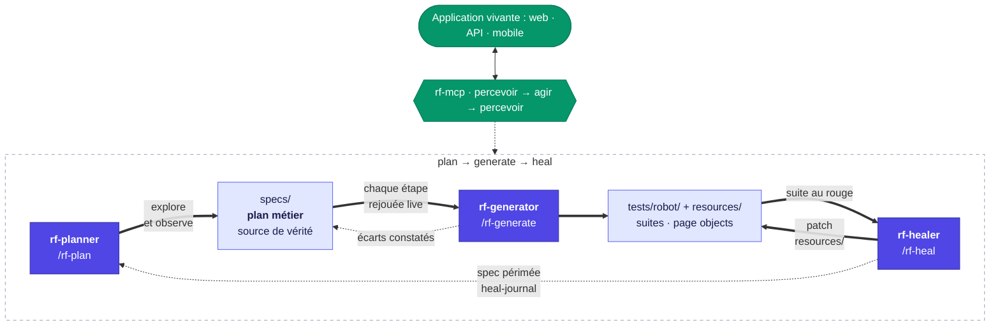

> 🇬🇧 English version: [README.md](README.md)

# rf-test-agents

**Agents de test universels pour Robot Framework : plan → generate → heal,
pilotés sur l'application vivante via le serveur
[rf-mcp](https://github.com/manykarim/rf-mcp) (RobotMCP).**

Indépendants de la technologie : les agents fonctionnent avec toute
bibliothèque Robot Framework que rf-mcp peut charger : web (Browser/Playwright,
SeleniumLibrary), APIs HTTP (RequestsLibrary), mobile (AppiumLibrary), bases de
données… Ils transposent l'idée des Playwright Test Agents
(planner / generator / healer) à l'écosystème Robot Framework, généralisés
depuis les agents SAP du projet SAPFX (même auteur). Licence : Apache-2.0.



Les flèches pleines sont le cycle ; les pointillés sont les boucles de
rétroaction qui gardent le plan honnête : le generator consigne les écarts
entre le plan et la réalité, le healer marque une spec périmée quand c'est le
flux métier lui-même qui a changé, et chaque réparation atterrit dans le
journal de guérison que le planner relit à sa passe suivante.

## Les quatre agents

| Agent | Commande | Ce qu'il fait |
|-------|----------|---------------|
| **rf-planner** | `/rf-plan` | Explore l'application vivante via rf-mcp (percevoir → agir → percevoir, snapshots ARIA, vraies réponses API) et écrit un plan de test lisible métier dans `specs/`. Chaque fait du plan a été observé live, jamais supposé. |
| **rf-generator** | `/rf-generate` | Transforme UN plan `specs/` en suite `.robot` exécutable. Sa discipline fondatrice : **aucune étape n'atterrit dans un fichier avant d'avoir été exécutée live** via rf-mcp. Les keywords métier manquants rejoignent la couche resources (page objects), jamais le corps des tests. |
| **rf-healer** | `/rf-heal` | Répare une suite en échec en corrigeant la **couche d'automatisation** (`resources/`), jamais en affaiblissant ce que le test prouve. Dérive de localisateur, timing, dérive de données et vrai changement fonctionnel ont chacun leur traitement ; un vrai changement de flux repart chez le planner. |
| **rf-istqb** | `/rf-istqb` | Concepteur de tests **hors ligne** (aucune session rf-mcp) : transforme les plans du planner et les sorties d'enregistrement (exports et brouillons rf-web-recorder) en un document **plan de test + cas de test ISTQB** sous `specs/istqb/` (sections ISO 29119-3, un cas de test par scénario, bloc `replay` YAML normalisé neutre vis-à-vis du framework : lisible par un humain ET rejouable par une IA avec n'importe quel framework de test). Ce qu'aucune source n'appuie reste « à compléter » ; il ne touche jamais `tests/robot/` ni `resources/`. Porté de l'agent `sap-istqb` de SAPFX. |

`/rf-generate-all` enchaîne le generator sur tous les plans éligibles
(séquentiellement : page objects partagés et session live unique ne se
parallélisent pas).

Le cycle est fermé par des gardes mécaniques et des boucles de rétroaction
explicites :

- **Provenance** : chaque suite générée embarque le hash (+ date) de son plan
  source ; `python scripts/check_spec_sync.py` échoue dès qu'un plan change
  sans régénération : **le plan est la source de vérité**.
- **Conventions** : `python scripts/check_conventions.py` rejette
  mécaniquement les localisateurs bruts dans les corps de test et tout `Sleep`
  (gate du generator, hook post-édition dans `.claude/settings.json`, CI).
- **Boucles de rétroaction** : le healer marque un plan fonctionnellement
  changé `> **Statut : PÉRIMÉE (date)**` (le garde bloque jusqu'à la
  ré-exploration par le planner) ; le generator consigne les écarts
  réalité/plan dans le plan lui-même (« Écarts constatés à la génération »)
  avant re-stamp ; chaque réparation est journalisée dans
  `docs/heal-journal.md`, la mémoire des dérives que le planner lit avant
  d'écrire ses notes de localisation.
- **Mémoire QA partagée** : quand le serveur MCP optionnel `qa-brain` est
  monté (RAG sur la mémoire QA de l'équipe : keywords, specs, docs, leçons
  écrites après incident réel), les quatre agents l'interrogent
  (`qa_search`, `qa_ask`, `qa_status`) avant leurs décisions de jugement :
  quelle ancre tient, dans quelle couche va un keyword, de quelle classe
  relève un échec, quel risque porte un cas de test. Cela ne remplace jamais
  l'observation : l'application live tranche, un passage retrouvé est une
  piste que l'on cite, et un serveur absent tient en une ligne de rapport
  sans rien bloquer.

## Conventions non négociables (ce que les agents font respecter)

1. **Les tests ne contiennent aucun localisateur brut.** CSS/XPath/ids vivent
   dans `resources/page_objects/*.resource` (un page object par page/écran/
   domaine API) ou `variables/locators.py` ; les tests parlent métier.
2. **Jamais de `Sleep` pour attendre.** Synchronisation réelle uniquement
   (`Wait For Elements State`, `Wait Until Element Is Visible`,
   `Wait Until Keyword Succeeds`).
3. **Assertions robustes.** Ids stables, rôle ARIA + nom accessible,
   `data-testid`, codes HTTP, champs JSON, comptes, jamais un libellé localisé
   quand une ancre stable existe.
4. **Jamais de localisateur inventé.** Chaque localisateur a été observé/sondé
   live avant d'être committé.
5. **Aucun credential dans un fichier.** Variables typées `Secret:` en ligne
   de commande (RF 7.4+), masquées même au niveau TRACE.

## Arborescence

```text
.claude/agents/        rf-planner / rf-generator / rf-healer / rf-istqb (définitions canoniques)
.claude/commands/      /rf-plan  /rf-generate  /rf-generate-all  /rf-heal
.claude/settings.json  hook post-édition lançant les deux gardes
.mcp.json              déclaration du serveur rf-mcp (Claude Code, portée projet)
.vscode/mcp.json       le même serveur rf-mcp, format VS Code (GitHub Copilot)
.github/chatmodes/     les agents en chat modes VS Code / Copilot (générés, ne pas éditer)
specs/                 plans de test métier (source de vérité)
resources/             common.resource + page_objects/ : la couche que les agents écrivent et réparent
variables/             env_<env>.yaml, locators.py partagé (jamais de credentials)
tests/robot/           suites générées : api/ · ui/web/ · ui/mobile/ · cross/
tests/unit/            tests pytest des scripts de garde
scripts/               check_spec_sync.py · check_conventions.py · hook_guards.py
docs/                  heal-journal.md (mémoire des dérives) · validation-live.md (runbook)
.github/workflows/     CI : tests unitaires + les deux gardes
results/               sorties robot (gitignoré)
```

## Démarrage rapide

```bash
python -m venv .venv && .venv\Scripts\activate     # Windows
pip install -r requirements.txt                     # décommenter d'abord la bibliothèque de votre canal
rfbrowser init                                      # seulement si robotframework-browser est activé
```

Ouvrir le dossier dans Claude Code (ou tout hôte d'agents compatible MCP) :
`.mcp.json` déclare le serveur rf-mcp. Puis :

```
/rf-plan     le parcours de connexion de https://monapp.example.com
/rf-generate specs/parcours-connexion.md
/rf-heal     tests/robot/ui/web/parcours_connexion.robot
```

Avec **GitHub Copilot dans VS Code**, rien à configurer : `.vscode/mcp.json`
déclare le même serveur rf-mcp (le démarrer depuis la vue des serveurs MCP au
premier usage), et les agents sont disponibles en chat modes. Choisir
`rf-planner`, `rf-generator`, `rf-healer` ou `rf-istqb` dans le sélecteur de
mode du chat, à la place des slash commands. Les chat modes sont générés
depuis `.claude/agents/` par `scripts/regen_agent_definitions.py` : modifier
l'agent, puis régénérer.

## Lien avec SAPFX

L'incarnation SAP de ces agents (keywords de perception SAP GUI, moteurs de
localisation UI5, télémétrie de healing) vit dans le projet SAPFX et y reste.
Ce projet est le **cœur universel** : uniquement les contrats génériques de
rf-mcp (`manage_session`, `execute_step`, `get_session_state`,
`get_locator_guidance`, `run_test_suite`…), sans plugin applicatif requis.
