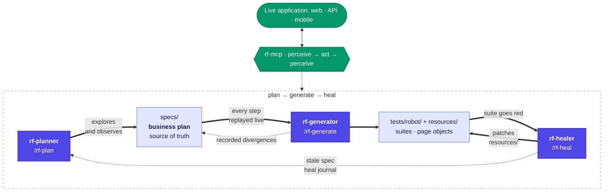

> 🇫🇷 Version française : [README.fr.md](README.fr.md)

# rf-test-agents

**Universal test agents for Robot Framework (plan → generate → heal) driven
by a live application through the [rf-mcp](https://github.com/manykarim/rf-mcp)
(RobotMCP) server.**

Technology-agnostic: the agents work with whatever Robot Framework library
rf-mcp can load: web (Browser/Playwright, SeleniumLibrary), HTTP APIs
(RequestsLibrary), mobile (AppiumLibrary), databases… They transpose the
Playwright Test Agents idea (planner / generator / healer) to the Robot
Framework ecosystem, generalized from the SAP-specific agents of the SAPFX
project (same author). License: Apache-2.0.



Solid arrows are the cycle; dotted arrows are the feedback loops that keep the
plan honest: the generator records where reality diverged from the plan, the
healer marks a spec stale when the business flow itself changed, and every
repair lands in the heal journal the planner reads next time.

## The four agents

| Agent | Command | What it does |
|-------|---------|--------------|
| **rf-planner** | `/rf-plan` | Explores the live application through rf-mcp (perceive → act → perceive, ARIA snapshots, real API responses) and writes a business-readable test plan under `specs/`. Every fact in the plan was observed live, never assumed. |
| **rf-generator** | `/rf-generate` | Turns one `specs/` plan into a runnable `.robot` suite. Its defining discipline: **no step lands in a file before it was executed live** through rf-mcp. Missing business keywords are added to the resource layer (page objects), never inlined in tests. |
| **rf-healer** | `/rf-heal` | Repairs a failing suite by fixing the **automation layer** (`resources/`), never by weakening what the test proves. Locator drift, timing, data drift and genuine functional changes each get their own treatment; genuine flow changes go back to the planner. |
| **rf-istqb** | `/rf-istqb` | Offline test designer (no rf-mcp session): turns planner specs and recorder outputs (rf-web-recorder exports and drafts) into an **ISTQB test plan + test cases** document under `specs/istqb/` (ISO 29119-3 sections, one test case per scenario, and a normalized framework-neutral `replay` YAML block per case: human-readable AND replayable by an AI with any test framework). What no source supports stays marked « à compléter »; it never edits `tests/robot/` or `resources/`. Ported from the SAPFX `sap-istqb` agent. |

`/rf-generate-all` chains the generator over every eligible spec (sequentially
shared page objects and one live session don't parallelize).

The cycle is closed by mechanical guards and explicit feedback loops:

- **Provenance**: each generated suite embeds the content hash (+ date) of
  its source spec; `python scripts/check_spec_sync.py` fails whenever a spec
  changed without regeneration: **the plan is the source of truth**.
- **Conventions**: `python scripts/check_conventions.py` mechanically rejects
  raw locators in test bodies and any `Sleep` (generator gate, post-edit hook
  in `.claude/settings.json`, CI).
- **Feedback loops**: the healer marks a functionally-changed spec
  `> **Statut : PÉRIMÉE (date)**` (blocks the guard until the planner
  re-explores); the generator records reality/spec divergences in the spec
  (« Écarts constatés à la génération ») before re-stamping; every repair is
  logged in `docs/heal-journal.md`, the drift memory the planner reads before
  writing locator notes.
- **Shared QA memory**: when the optional `qa-brain` MCP server is mounted (a
  RAG over the team's QA memory: keywords, specs, docs, lessons written after
  real incidents), the four agents query it (`qa_search`, `qa_ask`,
  `qa_status`) before their judgement calls: which anchor holds, which layer a
  keyword belongs to, which class a failure falls into, which risk a test case
  carries. It never replaces observation: the live application decides, a
  retrieved passage is a lead that gets cited, and an absent server is one line
  in the report, never a blocker.

## Non-negotiable conventions (what the agents enforce)

1. **Tests contain no raw locators.** CSS/XPath/element ids live in
   `resources/page_objects/*.resource` (one page object per page/screen/API
   domain) or `variables/locators.py`; tests speak business language.
2. **Never `Sleep` to wait.** Real synchronization only (`Wait For Elements
   State`, `Wait Until Element Is Visible`, `Wait Until Keyword Succeeds`).
3. **Robust assertions.** Stable ids, ARIA role + accessible name,
   `data-testid`, HTTP status codes, JSON field names, counts, never a
   localized display text when a stable anchor exists.
4. **Never fabricate locators.** Every locator was observed/probed live before
   being committed.
5. **Credentials never land in a file.** RF 7.4+ typed `Secret:` command-line
   variables, masked even at TRACE.

## Layout

```text
.claude/agents/        rf-planner / rf-generator / rf-healer / rf-istqb (canonical definitions)
.claude/commands/      /rf-plan  /rf-generate  /rf-generate-all  /rf-heal
.claude/settings.json  post-edit hook running both guards
.mcp.json              rf-mcp server declaration (Claude Code, project scope)
.vscode/mcp.json       same rf-mcp server, VS Code format (GitHub Copilot)
.github/chatmodes/     the agents as VS Code / Copilot chat modes (generated, never edit)
specs/                 business test plans (source of truth)
resources/             common.resource + page_objects/: the layer agents write & heal
variables/             env_<env>.yaml, shared locators.py (never credentials)
tests/robot/           generated suites: api/ · ui/web/ · ui/mobile/ · cross/
tests/unit/            pytest tests of the guard scripts
scripts/               check_spec_sync.py · check_conventions.py · hook_guards.py
docs/                  heal-journal.md (drift memory) · validation-live.md (runbook)
.github/workflows/     CI: unit tests + both guards
results/               robot outputs (gitignored)
```

## Quickstart

```bash
python -m venv .venv && .venv\Scripts\activate     # Windows
pip install -r requirements.txt                     # uncomment your channel's library first
rfbrowser init                                      # only if you enabled robotframework-browser
```

Open the folder in Claude Code (or any MCP-capable agent host): `.mcp.json`
declares the rf-mcp server. Then:

```
/rf-plan     the login flow of https://myapp.example.com
/rf-generate specs/login-flow.md
/rf-heal     tests/robot/ui/web/login_flow.robot
```

With **GitHub Copilot in VS Code**, no extra setup: `.vscode/mcp.json`
declares the same rf-mcp server (start it from the MCP servers view on first
use), and the agents are available as chat modes. Pick `rf-planner`,
`rf-generator`, `rf-healer` or `rf-istqb` in the chat mode picker instead of
the slash commands. The chat modes are generated from `.claude/agents/` by
`scripts/regen_agent_definitions.py`: edit the agent, then regenerate.

## Relationship to SAPFX

The SAP-specific incarnation of these agents (SAP GUI perception keywords,
UI5 locator engines, healing telemetry) lives in the SAPFX project and stays
there. This project is the **universal core**: rf-mcp's generic contracts only
(`manage_session`, `execute_step`, `get_session_state`, `get_locator_guidance`,
`run_test_suite`…), no application-specific plugin required.
